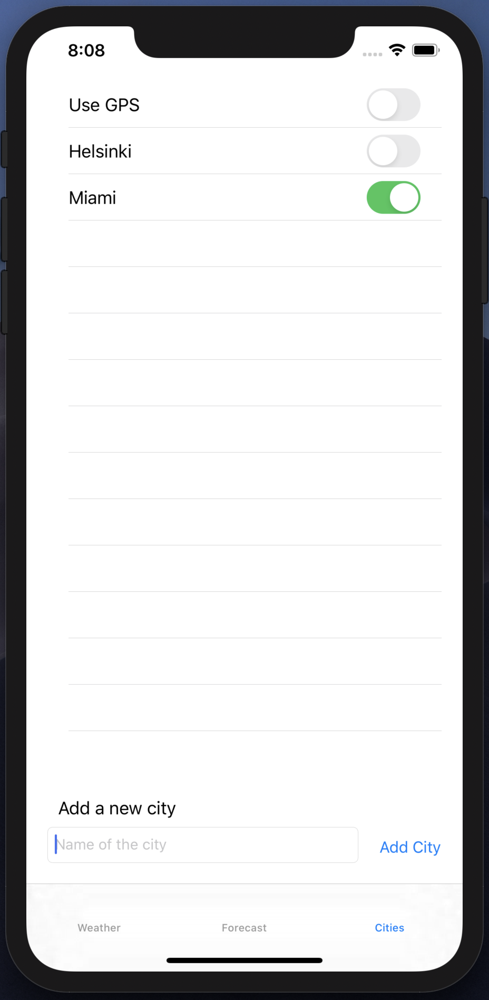

# Weather Application

A simple iOS application to see the current weather and forecast of any city or location

## Table of Contents
- [Introduction](#introduction)
- [Technologies](#technologies)
- [Setup](#setup)
- [Images](#images)

### Introduction
The application was made as a course project. The purpose of the project was to learn the basics of Swift programming and creating layouts using Xcode.

The application displays three basic views:
1. Weather view, which displays the current weather of the selected location
2. Forecast view, which displays the forecast for 5 next days for the selected location
3. Cities view, where user may add cities, select them or select to use the device's GPS to get the weather information

### Technologies
- Swift 5.1
- Xcode 11.1
- iOS 13

The application also utilizes the [OpenWeatherMap](https://openweathermap.org/api)'s *"Current weather data"* and *"5 day / 3 hour forecast"* APIs.

### Setup

The application should not require any special setup. The application should be runnable just by opening the project on Xcode and building and running the application using Xcode.

**NOTE**: Application may work only with Xcode 11+.

### Images

    
    
    

